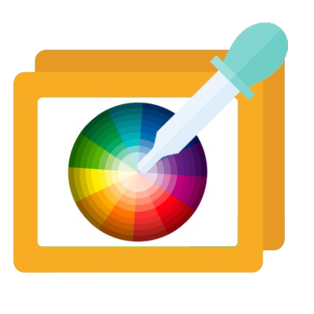
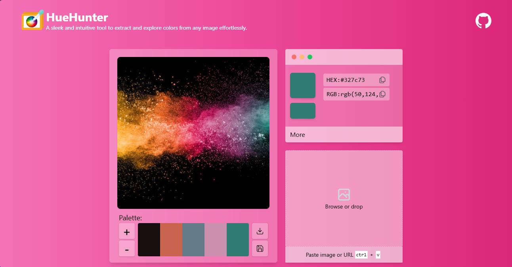

<p align="center">

</p>

# HueHunter

sleek and intuitive tool to extract and explore colors from any image effortlessly.

[](https://choosealicense.com/licenses/mit/)

## Screenshots



## Tech Stack

- React app bootstrapped with CRA
- Tailwindcss

## Lessons Learned

- Learned the structure of image.
- About pixels of image.
- Color maps.
- Quantization.

## TODO

- [ ] Implement option to tune pallete
- [ ] Use AI for color quantization.
- [ ] Add artistic option in colour palette.
- [ ] Option to save and view colour palette.
- [ ] Implement on boarding.

## Run Locally

Clone the project

```bash
git clone git@github.com:aumirza/image-color-picker.git
```

Go to the project directory

````bash
cd image-color-picker```

Install dependencies

```bash
npm install
````

Start the server

```bash
npm run start
```

## License

[MIT](https://choosealicense.com/licenses/mit/)

## Authors

- [@aumirza](https://www.github.com/aumirza)
